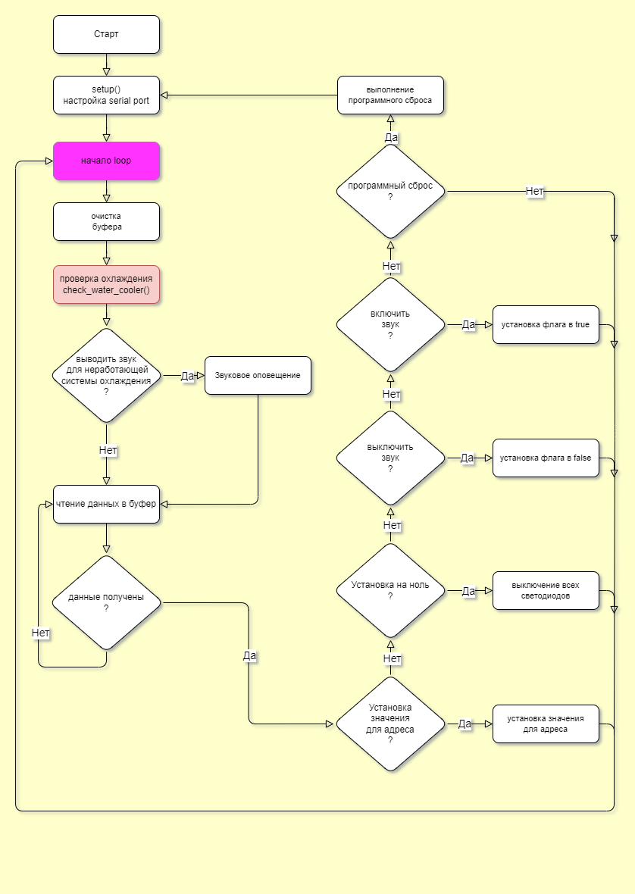

# Spectrasynthesizer
This is the code for arduino to control special equipment
(sphere). This sphere contains 32 diods (different wavelengths).
The arduino can change the current for any diod in specific range.
Commands are sended by serial port.

# Commands:
set voltage (relative measurements) value for the diod with specific number
a<address>_<value>
```javascript
a8_950
```
set the curret for all diods to zero
```javascript
f
```
mute warning sound for unworking water cooler system
```javascript
m
```
unmute warning sound for unworking water cooler system
```javascript
u
```
soft reset for arduino
```javascript
r
```